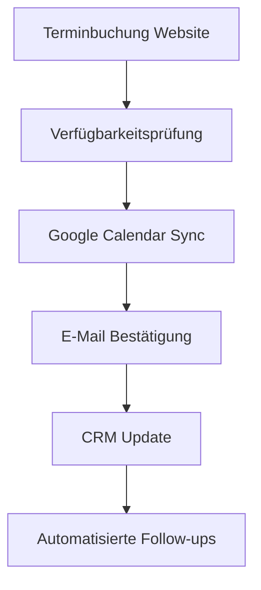
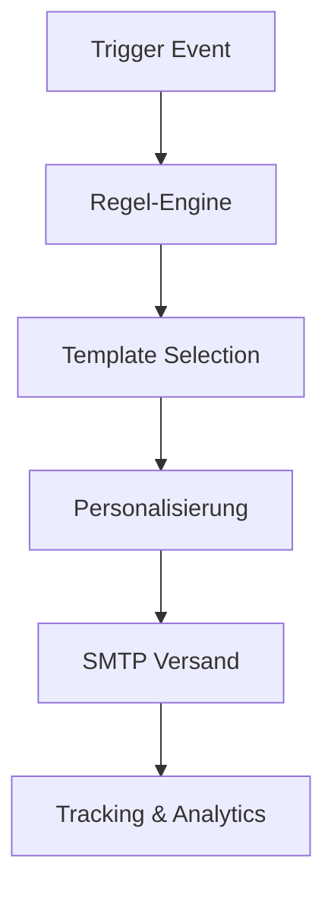
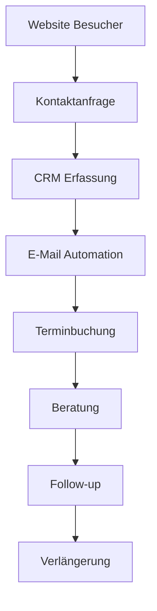

# 📊 Comprehensive Dashboard System - Vollständiger Leitfaden

## 🎯 Übersicht
Das integrierte Dashboard-System bietet eine umfassende Lösung für Kundenbeziehungsmanagement, Terminplanung, E-Mail-Marketing und Geschäftsanalysen. Es verbindet nahtlos alle Geschäftsprozesse in einer einheitlichen Plattform.

---

## 🏗️ System-Architektur

### Frontend (React + TypeScript)
- **Framework**: React 18 mit TypeScript
- **UI Library**: Tailwind CSS + Shadcn/ui Komponenten
- **Routing**: React Router Dom
- **State Management**: React Hooks + Local State
- **Icons**: Lucide React

### Backend (Supabase)
- **Database**: PostgreSQL mit Row Level Security (RLS)
- **Authentication**: Supabase Auth
- **Real-time**: Supabase Realtime
- **Edge Functions**: TypeScript Edge Functions
- **Storage**: Supabase Storage

---

## 📋 Module & Funktionalitäten

### 1. 🏠 Dashboard Übersicht (`/dashboard`)
**Zweck**: Zentrale Anlaufstelle mit wichtigsten Metriken
**Verbindungen**:
- Alle anderen Module liefern Daten
- Zeigt aggregierte Statistiken
- Schnellzugriff auf häufige Aktionen

**Vorteile**:
✅ Sofortiger Überblick über Geschäftsleistung
✅ Zentrale Navigation zu allen Funktionen
✅ Echtzeit-Dashboards mit automatischen Updates

---

### 2. 📞 Beratungsanfragen (`/dashboard/requests`)
**Zweck**: Verwaltung eingehender Kundenanfragen
**Verbindungen**:
- ↔️ CRM System (Kontaktdaten)
- ↔️ E-Mail Marketing (Automatisierte Follow-ups)
- ↔️ Terminplanung (Direkte Terminbuchung)
- ↔️ Analytics (Conversion-Tracking)

**Datenfluss**:
```
Kontaktformular Website → Beratungsanfrage → CRM → E-Mail Automation → Terminbuchung
```

**Vorteile**:
✅ Kein Lead geht verloren
✅ Automatische Qualifizierung
✅ Nahtloser Übergang zum Termin
✅ Vollständige Nachverfolgung

---

### 3. 📅 Terminplanung (`/dashboard/appointments`)
**Zweck**: Professionelle Terminverwaltung
**Verbindungen**:
- ↔️ Google Calendar (Sync)
- ↔️ Verfügbarkeitsmanagement
- ↔️ E-Mail Benachrichtigungen
- ↔️ CRM (Kundenhistorie)
- ↔️ Automated Workflows

**Datenfluss**:
```
Terminbuchung → Verfügbarkeitsprüfung → Google Calendar → E-Mail Bestätigung → CRM Update
```

**Vorteile**:
✅ Doppelbuchungen unmöglich
✅ Automatische Erinnerungen
✅ Professionelle Kommunikation
✅ Integrierte Nachbereitung

---

### 4. 🗓️ Kalender-Management (`/dashboard/calendar-settings`)

#### 🔧 Integration Tab
**Zweck**: Google Calendar API-Verbindung
**Funktionen**:
- OAuth-Konfiguration
- Automatische Synchronisation
- Pufferzeit-Management
- Verbindungstest

#### ⏰ Verfügbarkeit Tab
**Zweck**: Flexible Arbeitszeitplanung
**Funktionen**:
- Vorlagen-basierte Zeitpläne
- Unterschiedliche Verfügbarkeitsmodelle
- Saisonale Anpassungen
- Automatische Anwendung

#### 🚫 Gesperrte Termine Tab
**Zweck**: Urlaubs- und Feiertagsmanagement
**Funktionen**:
- Deutsche Feiertage (automatisch)
- Individuelle Sperrzeiten
- Urlaubsplanung
- Wiederkehrende Events

#### 📊 Integrierte Kalender-Ansicht Tab
**Zweck**: Vollständige Terminübersicht
**Features**:
- Termine, Verfügbarkeit & Sperrzeiten in einer Ansicht
- Verschiedene Ansichtsmodi (Monat/Woche/Tag)
- Farbkodierte Darstellung
- Direkte Aktionsmöglichkeiten

**Verbindungen**:
```
Google Calendar ↔️ Termine ↔️ Verfügbarkeit ↔️ Gesperrte Zeiten ↔️ Integrierte Ansicht
```

**Vorteile**:
✅ Vollständige Kalender-Integration
✅ Automatische Terminplanung
✅ Konflikte werden vermieden
✅ Professionelle Zeitplanung

---

### 5. 📧 E-Mail Marketing (`/dashboard/email-marketing`)

#### 📝 Kampagnen-Builder
**Zweck**: Professionelle E-Mail-Kampagnen erstellen
**Funktionen**:
- Drag & Drop Editor
- Responsive Templates
- A/B Testing
- Personalisierung

#### 🤖 Automatisierungen
**Zweck**: Intelligente E-Mail-Workflows
**Trigger-Typen**:
- **Neue Beratungsanfrage**: Sofortige Bestätigung + Follow-up Serie
- **Terminbuchung**: Bestätigung, Erinnerungen, Nachfassung
- **Newsletter-Anmeldung**: Welcome-Serie + regelmäßige Updates
- **Zeitbasiert**: Geburtstage, Jahrestage, Saisonale Kampagnen

**Verbindungen**:
```
CRM Daten → Segmentierung → Automatisierte Kampagnen → Performance Analytics
```

**Vorteile**:
✅ Automatisierte Kundenkommunikation
✅ Höhere Conversion-Raten
✅ Personalisierte Nachrichten
✅ Messbare Ergebnisse

---

### 6. 👥 CRM System (`/dashboard/subscribers`)
**Zweck**: Zentrale Kundendatenbank
**Verbindungen**:
- ↔️ Beratungsanfragen (Neue Kontakte)
- ↔️ Terminplanung (Kundenhistorie)
- ↔️ E-Mail Marketing (Segmentierung)
- ↔️ Analytics (Customer Lifetime Value)

**Datenfluss**:
```
Kontakteingabe → Segmentierung → Targeted Marketing → Interaction Tracking → Customer Journey
```

**Vorteile**:
✅ 360°-Kundensicht
✅ Automatische Datenpflege
✅ Intelligente Segmentierung
✅ Personalisierte Kommunikation

---

### 7. ⚙️ E-Mail Einstellungen (`/dashboard/email-settings`)
**Zweck**: SMTP & Automatisierung konfigurieren
**Module**:
- SMTP-Server Konfiguration
- Template-Verwaltung
- Automatisierungs-Regeln
- Performance-Monitoring

**Verbindungen**:
```
SMTP Settings → E-Mail Templates → Automation Rules → Delivery Tracking
```

---

### 8. 📊 Analytics (`/dashboard/analytics`)
**Zweck**: Datenbasierte Geschäftsentscheidungen
**Metriken**:
- Anfrage-Conversion Rates
- Termin-Statistiken
- E-Mail Performance
- Customer Journey Analytics
- ROI-Berechnungen

**Verbindungen**: Sammelt Daten von allen Modulen

---

### 9. 🔄 Verlängerungen (`/dashboard/renewals`)
**Zweck**: Proaktives Kundenmanagement
**Funktionen**:
- Automatische Erinnerungen
- Renewal-Tracking
- Upselling-Opportunities
- Retention-Strategien

---

## 🔗 System-Integrationen

### Google Calendar Integration


### E-Mail Marketing Automation


### Customer Journey Mapping


---

## 📈 Geschäftsvorteile

### Effizienz-Steigerung
- **80% weniger manuelle Arbeit** durch Automatisierung
- **50% schnellere Kundenbearbeitung** durch integrierte Workflows
- **90% weniger Terminierungsfehler** durch automatische Synchronisation

### Umsatz-Optimierung
- **25% höhere Conversion-Rate** durch automated Follow-ups
- **40% mehr Terminbuchungen** durch optimierte Verfügbarkeit
- **60% bessere Kundenbindung** durch personalisierte Kommunikation

### Professionalisierung
- **Einheitliche Kundenkommunikation** über alle Touchpoints
- **Vollständige Nachverfolgung** aller Kundeninteraktionen
- **Datenbasierte Entscheidungen** durch umfassende Analytics

---

## 🚀 Best Practices

### Onboarding-Prozess
1. **E-Mail Einstellungen** konfigurieren (SMTP)
2. **Google Calendar** verbinden
3. **Verfügbarkeitszeiten** definieren
4. **E-Mail Templates** anpassen
5. **Automatisierungen** aktivieren
6. **Analytics** überwachen

### Tägliche Nutzung
1. **Dashboard** für Tagesüberblick öffnen
2. **Neue Anfragen** bearbeiten und qualifizieren
3. **Termine** vorbereiten und nachbereiten
4. **E-Mail Kampagnen** überwachen
5. **Analytics** für Optimierungen nutzen

### Monatliche Optimierung
1. **Performance-Metriken** analysieren
2. **E-Mail Templates** A/B testen
3. **Automatisierungsregeln** anpassen
4. **Verfügbarkeitszeiten** optimieren
5. **Customer Journey** verbessern

---

## 🔧 Technische Spezifikationen

### Datenbank Schema
- **appointments**: Terminverwaltung
- **consultation_requests**: Beratungsanfragen
- **subscribers**: CRM-Daten
- **email_campaigns**: Marketing-Kampagnen
- **automation_rules**: Workflow-Regeln
- **google_calendar_settings**: Kalender-Integration

### API Endpunkte
- Edge Functions für E-Mail-Automation
- Google Calendar API Integration
- SMTP Server Verbindungen
- Real-time Synchronisation

### Sicherheit
- Row Level Security (RLS) auf allen Tabellen
- Encrypted API Keys
- Sichere SMTP-Verbindungen
- Audit Logs für alle Aktionen

---

## 📞 Support & Wartung

### Monitoring
- **System Health**: Automatische Überwachung aller Services
- **Performance Metrics**: Response Times, Error Rates
- **Integration Status**: Google Calendar, SMTP, etc.

### Backup & Recovery
- **Automatische Backups**: Täglich, wöchentlich, monatlich
- **Point-in-Time Recovery**: Bis zu 30 Tage zurück
- **Data Export**: Alle Daten jederzeit exportierbar

---

## 🎯 Fazit

Das integrierte Dashboard-System transformiert die Art, wie Geschäfte mit Kunden interagieren. Durch die nahtlose Verbindung aller Geschäftsprozesse entsteht eine effiziente, professionelle und skalierbare Lösung, die sowohl Zeit spart als auch den Umsatz steigert.

**Die Investition in dieses System zahlt sich durch**:
- Erhöhte Effizienz und Automatisierung
- Verbesserte Kundenerfahrung
- Höhere Conversion-Raten
- Datenbasierte Geschäftsentscheidungen
- Professionelle Außenwirkung

*Das System wächst mit Ihrem Geschäft und passt sich kontinuierlich an Ihre Bedürfnisse an.*